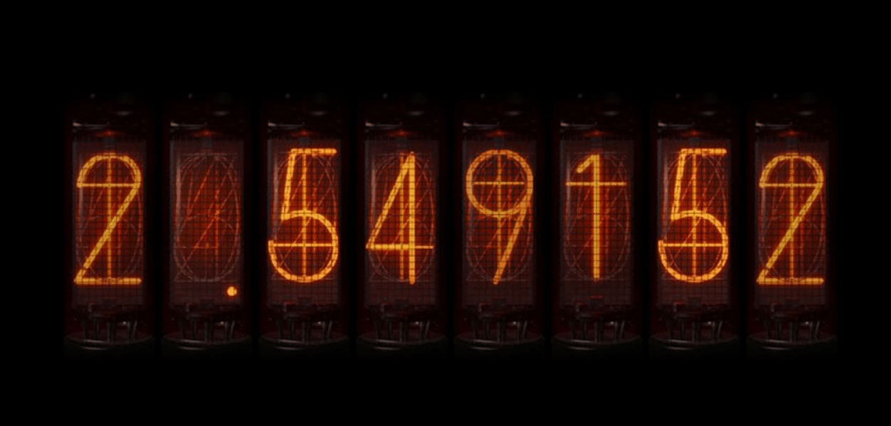
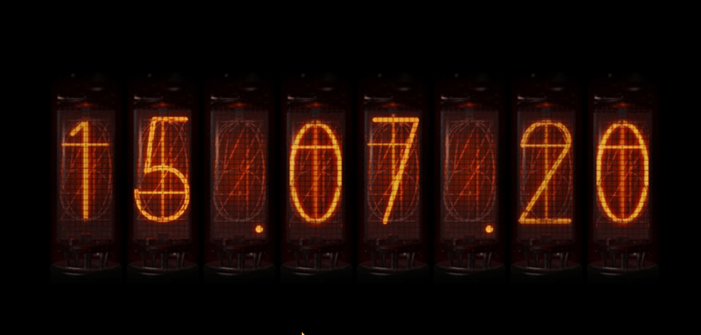

# 西梅时钟

## 简介

这款软件主打一个成分复杂！（哈哈哈）

起这个软件名字，是因为今天我种了一棵西梅树，还因为我喜欢的球星是梅西（哈哈哈）

## 软件功能

本来受软件Pomy启发，想做个遵循 20-20-20 视力保护原则的休息提醒工具（但因为pomy是商店的软件，我用的精简版系统懒得装商店，于是乎自己写个吧）

最近在重温《命运石之门》，既然是钟表，那就用辉光管吧（泰酷辣！）

切换功能——点击右键

* 功能一：只显示时分不显示秒的钟表

* 功能二：遵循 20-20-20 视力保护原则的休息提醒工具
倒计时20分钟，到时间会有小咪提醒你喝水（20秒），顺便眼睛看向20米外（强行20-20-20，哈哈）

这里玩梗，当然你可以用自己的图（自定义休息图，替换image文件夹的relax.jpg文件）

* 功能三：随机排列5
因为设计用5根辉光管，正好我妈让我去买彩票，灵光一闪，加个体彩随机排列5的功能吧
说不定一不小心我的用户跟着买就中奖了呢（那是不可能的）

## 下载

推荐放在屏幕右下角使用

[蓝奏云](https://ifwz.lanzouw.com/i6GwP0u7he6f)

提升上班工作效率，每天要喝够8杯水哦！

软件开源，欢迎star，允许魔改

# 屏保部分

5月17日更新

